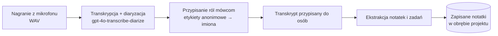

# Mentat — nagrywarka spotkań i ekstraktor notatek

> **Uwaga o zakresie (dla autorów):** To wspólny szkielet raportu.
> Poniższe sekcje są w pełni napisane dla części **audio → transkrypcja → diaryzacja → przypisanie ról mówcom**.
> Sekcje oznaczone _[Kolega — ekstrakcja notatek / eksperymenty]_ to miejsca do uzupełnienia przez autora ekstrakcji notatek.

---

## 1

### 1.1 Opis problemu

Spotkania i rozmowy są podstawowym nośnikiem decyzji, zadań i wymiany wiedzy, a mimo to ich rezultat niemal nigdy nie jest zapisywany w ustrukturyzowanej formie. Uczestnicy albo robią notatki ręcznie — co jest niekompletne, rozprasza i bywa niespójne — albo polegają na pamięci. Surowe nagrania też nie są rozwiązaniem: nie da się ich przeszukiwać, ich przegląd jest czasochłonny i nie zawierają informacji, *kto co powiedział*.

Zamiana nagrania w coś użytecznego to problem wieloetapowy. Najpierw mowa musi zostać zamieniona na tekst (**transkrypcja**). Następnie tekst trzeba przypisać do poszczególnych mówców (**diaryzacja**, czyli „kto i kiedy mówił"), ponieważ zadania i wypowiedzi mają sens dopiero wtedy, gdy są powiązane z konkretną osobą. Na końcu anonimowe etykiety mówców (`A`, `B`, `C`) trzeba rozwiązać do **rzeczywistych uczestników**, aby wynik był czytelny. Dopiero wtedy dalsza analiza (ekstrakcja notatek i zadań) może działać na czystym, przypisanym transkrypcie.

Każdy etap ma własne tryby błędów. Modele transkrypcji z rodziny Whisper są znane z **halucynacji** — wymyślają prawdopodobnie brzmiący tekst podczas ciszy, szumu tła czy przełączania języka — co psuje wszystko w dalszej części pipeline'u. Diaryzacja może dzielić mówców zbyt grubo lub zbyt drobno. Nazywanie mówców jest dwuznaczne: imię wypowiedziane na głos (np. *„Bartek, czy mógłbyś…"*) zwykle odnosi się do *słuchacza*, a nie do mówiącego — co naiwne heurystyki mylą.

### 1.2 Cel projektu

Celem **Mentata** jest wieloplatformowa aplikacja desktopowa/mobilna (oparta na .NET MAUI), która nagrywa spotkanie i zamienia je w ustrukturyzowane, przypisane do osób notatki przy minimalnym wysiłku użytkownika — najlepiej w jednej interakcji *Nagraj / Stop*. Aplikacja jest nakierowana na rozmowy w **języku polskim**.

Pełny pipeline wygląda następująco:

Niniejszy raport skupia się na **pierwszej połowie pipeline'u (A → C)**: nagraniu audio, wytworzeniu dokładnego transkryptu z diaryzacją oraz rozwiązaniu anonimowych etykiet mówców do nazwanych uczestników. Etap ekstrakcji notatek (D → F) jest opisany osobno przez współautora odpowiedzialnego za tę część.

---

## 2. Metody i dane

### 2.1 Opis metody

Przepływ od nagrania do transkryptu jest sterowany w [`MainPage.StopTranscribeAndProcessAsync`](../src/Mentat/MauiApp/MainPage.xaml.cs#L96) i składa się z trzech kroków, każdy ukryty za niewielkim interfejsem, dzięki czemu komponenty można wymieniać niezależnie:

1. **Nagranie audio.** Pojedynczy przycisk *Nagraj / Stop* zapisuje dźwięk z mikrofonu do strumienia WAV w pamięci ([`RecordingService`](../src/Mentat/MauiApp/Services/RecordingService.cs)).
2. **Transkrypcja + diaryzacja.** Strumień WAV jest wysyłany do API transkrypcji OpenAI z użyciem modelu **`gpt-4o-transcribe-diarize`** ([`TranscriptionService`](../src/Mentat/Mentat.Infrastructure/Transcription/TranscriptionService.cs)). Jedno wywołanie modelu realizuje jednocześnie zamianę mowy na tekst *oraz* diaryzację, zwracając segmenty ze znacznikami czasu, każdy oznaczony anonimową etykietą mówcy. Żądanie przypina język wypowiedzi do polskiego (`language=pl`), aby ograniczyć halucynacje wynikające z dryfu języka, prosi o format odpowiedzi `diarized_json` i używa automatycznego dzielenia (chunking) dla nagrań dłuższych niż 30 s. Wynik jest mapowany na wewnętrzny `DiarizedTranscript` z segmentami `(Mówca, Tekst, Start, Koniec)`.
3. **Przypisanie ról mówcom.** Anonimowe etykiety (`A`, `B`, …) są mapowane na rzeczywistych uczestników przez [`SpeakerResolver`](../src/Mentat/Mentat.Infrastructure/LLM/SpeakerResolver.cs), który podaje oznaczone linie do modelu LLM ograniczonego schematem JSON (structured output). Prompt koduje dwie reguły rozróżniające: **regułę wołacza** (imię użyte, by *zwrócić się* do kogoś, należy do słuchacza, a nie do mówiącego) oraz **regułę odniesienia do siebie** (imię przypisuje się mówcy tylko wtedy, gdy sam się przedstawi, np. *„tu Bartek"*). Imiona są przypisywane wyłącznie wtedy, gdy zostały jednoznacznie ujawnione w rozmowie; w przeciwnym razie mówcy otrzymują kolejno `Osoba 1`, `Osoba 2`, … numerowane według pierwszego pojawienia się. Przeetykietowany transkrypt jest punktem przekazania do etapu ekstrakcji notatek.

### 2.2 Przegląd stanu wiedzy (state of the art)

Współczesna transkrypcja mowy jest zdominowana przez duże, wielojęzyczne modele neuronowe. OpenAI **Whisper** (`whisper-1`) ustanowił otwarty punkt odniesienia, ale jest podatny na halucynacje podczas ciszy i szumu. Obecna generacja — OpenAI **`gpt-4o-transcribe`** oraz jego wariant z diaryzacją **`gpt-4o-transcribe-diarize`** — poprawia dokładność i łączy diaryzację w jednym wywołaniu API. Dla języka polskiego najwyższą dokładność osiąga obecnie **ElevenLabs Scribe** (≈3,1% WER na FLEURS, ≈5,5% na Common Voice) z diaryzacją do 32 mówców; mocnymi alternatywami są **Speechmatics**, **Gladia Solaria-1** (czołowy współczynnik błędu diaryzacji), **Deepgram Nova-3**, **AssemblyAI Universal** (deklaruje ~30% mniej halucynacji niż Whisper Large-v3) oraz **Google Chirp**. Dwie istotne metryki jakości to **WER** (Word Error Rate) dla transkrypcji i **DER** (Diarization Error Rate) dla przypisania mówców. W projekcie wybrano `gpt-4o-transcribe-diarize`, ponieważ zapewnia transkrypcję *i* diaryzację w jednym wywołaniu z natywnym wsparciem dla polskiego; głównym kandydatem na upgrade — gdyby dokładność okazała się niewystarczająca — jest ElevenLabs Scribe.

### 2.3 Opis technologii

| Warstwa | Technologia |
|---|---|
| Framework aplikacji | .NET MAUI (C#) — wieloplatformowy interfejs desktop/mobile |
| Nagrywanie audio | `Plugin.Maui.Audio` 4.0.0 (natywny mikrofon platformy) |
| Transkrypcja + diaryzacja | OpenAI Audio Transcription API, model `gpt-4o-transcribe-diarize`, wywoływany przez `HttpClient` (multipart/form-data) |
| Przypisanie ról mówcom | OpenAI Chat (`gpt-5-mini`) ze structured output wg schematu JSON, przez OpenAI .NET SDK 2.10.0 |
| Serializacja | `System.Text.Json` |

Każdy etap znajduje się za interfejsem (`IRecordingService`, `ITranscriptionService` oraz abstrakcja `SpeakerResolver` nad połączeniem z LLM), co pozwala wymienić dostawcę transkrypcji bez ingerencji w resztę aplikacji.

### 2.4 Opis danych

Wejściem jest **dźwięk z mikrofonu na żywo** — spotkania w języku polskim, nagrywane jako **WAV** (częstotliwość próbkowania i liczba kanałów wynikają z domyślnych ustawień platformy nagrywającej; typowym przypadkiem jest mowa mono). Nie ma stałego, oznaczonego korpusu o ustalonym rozmiarze: system jest oceniany jakościowo na rzeczywistych i zaaranżowanych nagraniach oraz na krótkich, scenariuszowych polskich transkryptach spotkań używanych w testach integracyjnych (zob. `tests/Mentat.IntegrationTests`). Jakość transkrypcji ocenia się przez brak zhalucynowanego tekstu i poprawny język; diaryzację i nazywanie — przez to, czy tury mówców są poprawnie rozdzielone, a nazwani uczestnicy odpowiadają rozmowie.

> _[Kolega — ekstrakcja notatek] Tu trafiają opisy metody, technologii i danych dla etapu ekstrakcji notatek i zadań._

---

## 3. Wyniki

> _[Kolega — eksperymenty] Tu trafiają wyniki eksperymentów / prezentacja działającego systemu oraz obserwacje._
>
> _Dla części transkrypcja/diaryzacja proponowane obserwacje do opisania: wpływ przypięcia `language=pl` na liczbę halucynacji; jakościowa ocena diaryzacji na nagraniach wieloosobowych; poprawność reguł nazywania mówców (wołacz / odniesienie do siebie)._

---

## 4. Podsumowanie

> _[Kolega / wspólnie] Tu trafiają kluczowe wnioski i spostrzeżenia._

---

## Bibliografia

- OpenAI — przewodnik *Speech to text*. https://developers.openai.com/api/docs/guides/speech-to-text
- OpenAI — dokumentacja modelu *GPT-4o Transcribe Diarize*. https://developers.openai.com/api/docs/models/gpt-4o-transcribe-diarize
- OpenAI — dokumentacja modelu *GPT-4o Transcribe*. https://developers.openai.com/api/docs/models/gpt-4o-transcribe
- ElevenLabs — *Scribe* speech-to-text (język polski). https://elevenlabs.io/speech-to-text/polish
- A. Radford i in., *Robust Speech Recognition via Large-Scale Weak Supervision* (Whisper), 2022. https://arxiv.org/abs/2212.04356
- `Plugin.Maui.Audio` — biblioteka audio dla .NET MAUI. https://www.nuget.org/packages/Plugin.Maui.Audio
- OpenAI .NET SDK. https://www.nuget.org/packages/OpenAI

> _[Kolega] Dodaj źródła dla etapu ekstrakcji notatek._
